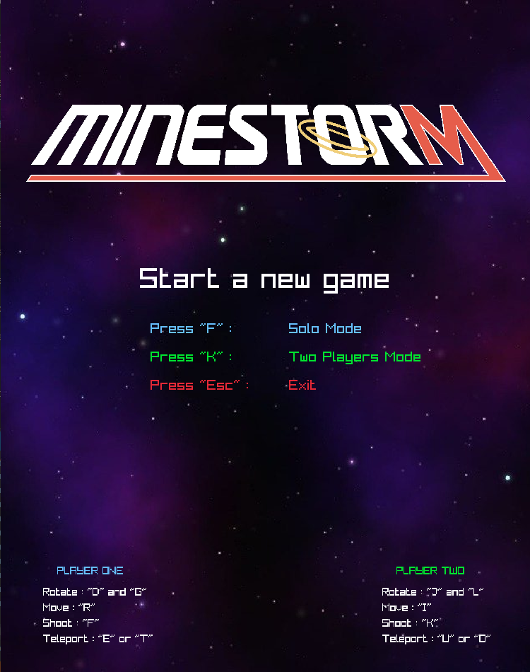
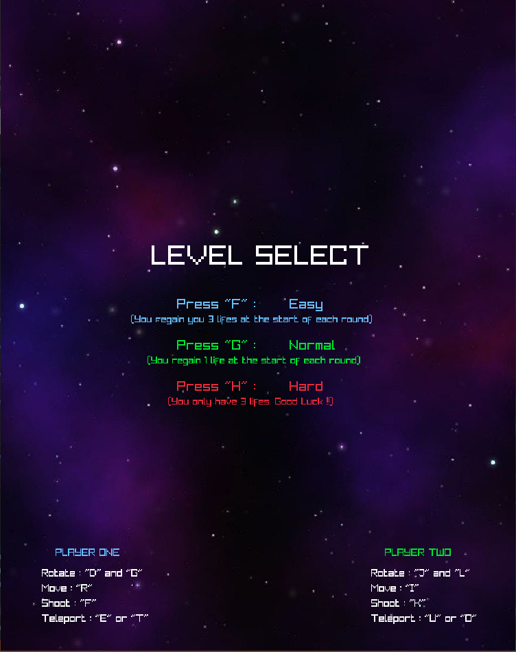
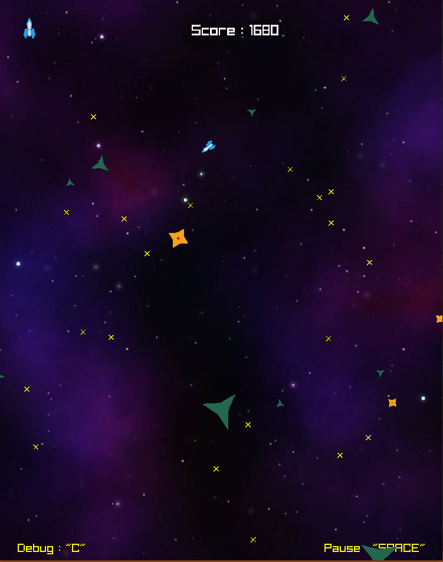
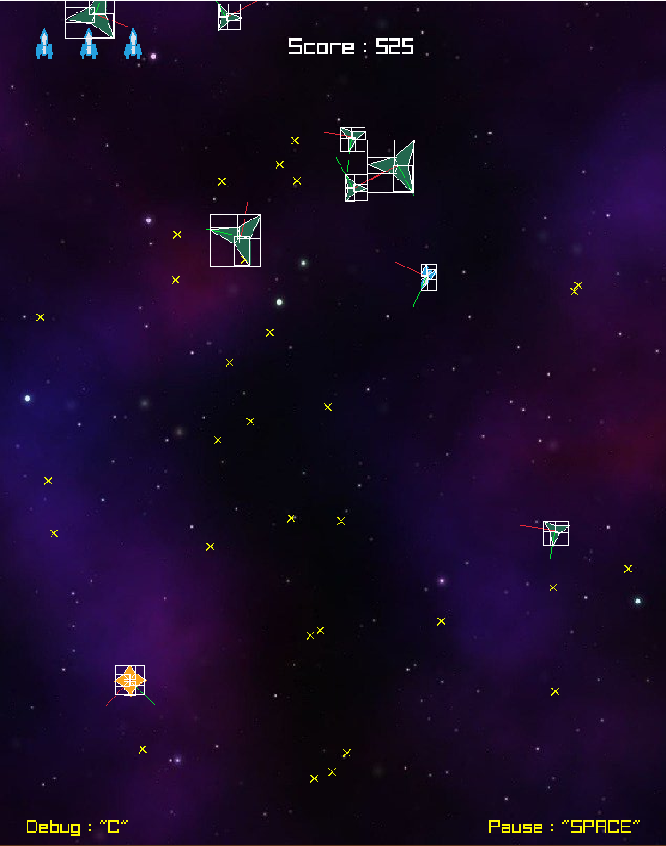
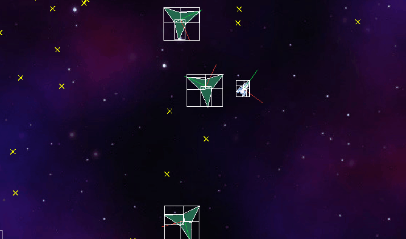
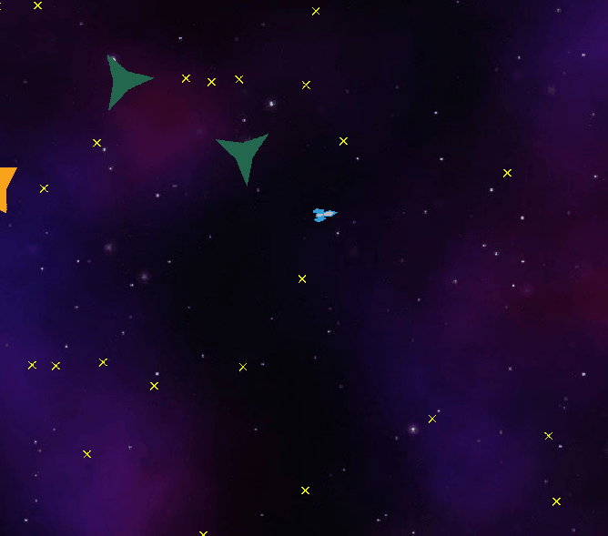

# **Project Minestorm - Sasha Legrand - 24/11/2020**

## ***Summary*** :
- Launch Game
- Game Principle
- Inputs
- Description
- Mathematics
- Bugs
- Render

## **Launch Game :**
___
First, compile the project in visual studio (Debug or release). Then you can launch the "run.bat" or the "runDebug.bat" (depends how you compile the project) to run the game.

Enjoy !!

## **Game Principle :**
___
### Objective : 
Get acquainted with architecture and maths in video games.
The goal was to recreate the MineStorm game launch in 1982 on Vertrex.

The player embodied a space ship and has to destroy every enemys (mines, mine-layer) seen on the screen.
If collide with an enemy, the player lose a life. 
The game finish when the player complete all the levels or when the player lose all his lifes.

## **Inputs :**
___
## Main Menu :
- Launch a solo game : "F"
- Launch a duo game : "K"
- Exit the game : "Esc"

## Level Select :
- Launch easy mode :   "F"
- Launch normal mode : "G"
- Launch hard mode :   "H"

## Gameplay :
- Pause the game : 	    "SPACE"
- Display collisions boxes :  "C"
- ### Player one : 
    - Move forward "R"
    - Turn left "D"
    - Turn right "G"
    - Shoot "F"
    - Teleport "E" or "T"
- ### Player two:  
    - Move forward "I"
    - Turn left    "J"
    - Turn right   "L"
    - Shoot	    "K"
    - Teleport     "U" or "O"

## **Description :**
___

## Player : 
* He control a space ship and can move forward or change direction.
* Ship use an inertia that follow the Newton law.
* He can shoot bullets and destroy enemys. (are other players in duo mode)
* He win points for every enemys killed.
* He lose a life if collide with a mine. (He got 3 lifes)
* He complete the round when he killed every enemys on screen.
* He can to one side of the screen to get to the other side. (Same for mines and bullets)

## Spawn Mine Layer :
At the start of each round, the spawn mine layer goes down from the top of the screen to place spawnpoints for enemys.

## Mines :
Mines are the enemys of the player. They have three different sizes (Big, Medium and Small). Only big mines can spawn on spawn points at the beginning of the round.

When a big mine is destroy, two medium mines appears. Same for medium mines, when destroy, two small mines spawn. It represent a total of 7 mines for 1. (1 Big, 2 Medium and 4 Small).

* ### *Types of mines* : 
    * Floating Mine : Regular mine that derive in one random direction.
    * Fireball Mine : Same has Floating mine but launch a fireball in direction ofthe player when killed.
    * Magnetic Mine : Follow the player (Take the shortest path).
    * Magnetic-Fireball Mine : Magnetic and Fireball mines combined.

* ### *Other :*
    * Mine-Layer : Mother Ship. Spawn on one side of the screen to add new spawn points when others disappear (Spawn one time per round).

## Screen borders :
Every screen borders allow to go the other side of the screen (for players, bullets and mines).

## **Mathematics :**
___
The first and main objective of this project was to re-use the mathematic toolbox made in C and implement the SAT algorithm to get 2D collisions.

## Toolbox : 
Contain every tools to implement collision (Vector2D, Rectangle, ConvexPolygon, etc..)

- *File Path* = "toolbox/" + "include/collider.h" || "src/collider.cpp"

## Dynamic newtonian model :
The movement of the player is subject to the newton law.

- *File Path* = "include/player_movement.h" || "src/player_movement.cpp"

## Referential changement
- *File Path* = "toolbox/referential2D.h" || "toolbox/referantial2D.cpp"

## SAT methods for collisions detection :
All function relative to the SAT algorithm.
- *File Path* = "toolbox/intersection2d.h" || "toolbox/intersection2d.cpp"

## Game implementations that use the SAT algorithm :
The SAT was use to implement most of the collisions in the game.
- *File Path* = "include/collision.h" || "src/collision.cpp"

## Others mathematic methods :
All the algorithm of collisons detection (box-box, circle-box, circle-circle).
- *File Path* = "include/intersection2d.h" || "src/intersection2d.cpp"

The method for enemys to follow the player and get the shortest path.
- *File Path* = "src/magnetic_mine.cpp" || "src/magnetic_fireball_mine.cpp"

Every utils function (clamp, lerp, randRange, toRadians).
- *File Path* = "toolbox/maths.h" || "toolbox/maths.cpp"

## **Bugs :**
___
- Sometimes when you are in game and return to the main menu, when launching the game the mother ship sound is not played.

## **Render :**
___

## Main Menu :

## Level Select :

## In game render :

## Debug :

## Collisions :

## Example particles :

